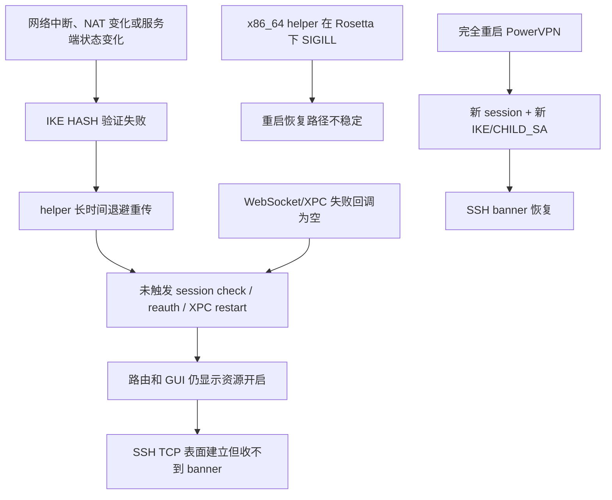

<!-- markdownlint-disable MD013 MD060 -->

# PowerVPN 假在线、SSH 无 banner 事件：互动记录与诊断复盘

日期：2026-08-08  
作者：Zhuoyuan Hao、Codex  
状态：诊断完成；最终修复方案尚未确定  
结论：**现有本地 CLI 仅保留为诊断原型，不应视为根治方案。**

## 1. 摘要

本次事件最初表现为：PowerVPN 图形界面中 `login21` 和 `login52` 均处于开启状态，macOS 也保留了对应路由，但 `thu21`、`thu52` 的 SSH 连接在 TCP 建立后始终收不到 SSH banner。退出并重新启动 PowerVPN 后，两台服务器立即恢复。

完整证据表明，这不是 Surge 冲突、SSH key、用户名、ControlMaster 或 aTrust 导致的问题。最接近真实故障的解释是：

1. PowerVPN 的 IKEv1 数据面进入失效状态，但 GUI 和路由仍保持“在线”；
2. helper 收到无法验证的 IKE `HASH_V1`，随后进行分钟级退避重传；
3. 重传失败并没有触发 session 检查、重新鉴权或 tunnel 重建；
4. GUI 内已有 `checkSessionAction` 和 `reStartXPCConnection...`，但 WebSocket/XPC 失败回调没有调用恢复逻辑；
5. 重启应用后，旧连接被停止，新 session 和新的 IKE/CHILD_SA 建立，SSH banner 随即恢复；
6. 另外，纯 x86_64 的 `charon-xpc` 在 Rosetta 下还出现了 `SIGILL`，但它发生在重启阶段，属于独立的稳定性缺陷，不能被当成最初假在线的唯一原因。

我们随后实现了一个 Apple Silicon 原生 CLI，能够读取 helper、日志摘要和 SSH banner，并显式重启 PowerVPN。它对诊断有价值，但没有修复协议状态机，也仍依赖厂商 x86_64 helper，因此不应被包装成最终解法。

## 2. 影响范围

### 用户可见症状

- PowerVPN 显示账号 `lijuanzi` 已登录；
- `login21`、`login52` 的开关均为开启；
- `thu21` 和 `thu52` 的 TCP 22 可以建立；
- SSH 在密钥交换之前卡住，没有进入用户名或公钥认证；
- 重启 PowerVPN 后恢复。

### 未发生的操作

- 没有修改 `/Applications/PowerVPN.app`；
- 没有重签名厂商应用或 helper；
- 没有关闭或 reload Surge；
- 没有安装 LaunchAgent/watchdog；
- 没有把 session ID、密码或 token 写入新项目；
- 没有将项目推送到 GitHub。

## 3. 互动过程与判断变化

### 3.1 从 THU GPU 下载任务进入网络诊断

最初任务是在 THU GPU 上下载较小的 Qwen3.5 模型。`ssh thu21` 多次在 SSH banner 阶段超时，因此模型下载没有启动，也没有留下半截远程文件。

早期判断只确认了“TCP 可达、SSH banner 不到”，还不能区分远端 sshd、VPN 数据面或本机路由问题。

### 3.2 第一次误判：错误地把 aTrust 纳入 THU 链路

本机同时运行了 aTrust 和 PowerVPN。第一次 GUI 检查中，我们错误地读取了 aTrust 登录页，并把它与 THU 访问联系起来。

用户随后明确纠正：

> THU GPU 只能通过 PowerVPN；aTrust 与 THU 是两套完全独立的系统。

这一纠正是必要的。此后所有结论只基于 PowerVPN、`utun8` 和 THU 目标地址，aTrust 被彻底排除。

### 3.3 PowerVPN UI 与实际路由

PowerVPN 的实时界面显示：

- 当前账号：`lijuanzi`；
- `login52`：开启；
- `login21`：开启。

macOS 路由检查显示下列目标均走 `utun8`：

- `11.11.30.21`；
- `11.11.37.52`；
- PowerVPN 为 `thu51` 合成的 `198.18.96.193`。

因此，故障不是“资源开关未开启”或“目标流量根本没有进入 PowerVPN”。

### 3.4 `thu51`、`thu52` 与 SSH alias 的澄清

本机 SSH 配置中存在：

| alias | HostName | User |
|---|---|---|
| `thu21` | `11.11.30.21` | `lijuanzi` |
| `thu52` | `11.11.37.52` | `lijuanzi` |

不存在 `thu51` 的专用 SSH block。直接运行 `ssh thu51` 时：

- 使用全局用户 `larry-new`；
- 名称由 PowerVPN DNS 映射到 synthetic IP `198.18.96.193`。

不过，原始失败发生在服务端发送 SSH banner 之前，用户名尚未参与协议，所以错误用户不是这次 banner 超时的原因。有效的 sibling 对照目标应是 `thu52`。

### 3.5 SSH 分层探针

诊断使用了全新连接，显式绕过已有 ControlMaster：

```bash
ssh -vv \
  -S none \
  -o ControlMaster=no \
  -o ControlPath=none \
  -o BatchMode=yes \
  -o ConnectTimeout=10 \
  thu21 true
```

故障期观察到：

- `nc` 显示 TCP 22 可建立；
- `thu21` 长时间等待 banner 后超时；
- `thu52` 曾出现连接后立即关闭，也曾表现为 banner 超时；
- 两者都没有进入 key exchange 或 public-key authentication。

这排除了 SSH key、known_hosts、用户名和 ControlMaster 复用问题。

### 3.6 Surge 冲突假设

用户提出 Surge 是否与 PowerVPN 冲突。我们进行了不修改配置的检查：

- Surge 运行于 Rule 模式；
- 三个目标的实际路由均指向 `utun8`；
- Surge recent connections 中没有对应的 SSH 目标；
- SSH 配置没有 HTTP/SOCKS `ProxyCommand`；
- 未关闭 Surge的情况下，重启 PowerVPN 后 SSH 恢复。

结论：**没有证据表明 Surge 是本次故障的因果因素。**

### 3.7 用户重启 PowerVPN 后恢复

用户退出并重新启动 PowerVPN。随后：

- `thu21` 返回 `SSH-2.0-OpenSSH_8.9p1 Ubuntu-3ubuntu0.10`；
- `thu52` 返回相同 banner；
- 延迟约 100–123 ms；
- Surge 没有改动；
- 远端 SSH 配置没有改动。

这是最关键的反事实证据：恢复动作只发生在 PowerVPN 客户端侧。

### 3.8 第二次误判：把 PowerVPN 当成 Electron 应用

由于 UI 风格和应用行为，我们最初尝试按 Electron 应用寻找 `app.asar`。实际检查表明：

- 没有 `app.asar`；
- 主程序是原生 AppKit/Cocoa Objective-C；
- 主程序为纯 `x86_64` Mach-O；
- Electron 解包流程在 dry-run 阶段停止，没有产生提取结果。

这次误判随后被本机二进制证据纠正。

### 3.9 从 watchdog 到 CLI，再到对 CLI 的重新评价

在确认“重启即可恢复”后，我们先提出外部 watchdog。这个选择过早：它只观察结果并重启黑盒，没有利用已经发现的内部恢复入口。

用户指出，与其做后台 watchdog，不如重构成显式 CLI。于是实现了 `powervpn` CLI，提供：

- `status`；
- `probe`；
- `diagnose`；
- `reconnect --yes`。

CLI 是一个更透明的诊断工具，但用户进一步指出它仍不是好的最终解法。这个判断是正确的：CLI 只是把“手动重启 GUI”包装成命令，并没有修复 session/IKE 状态机。

## 4. 本机客户端与供应链事实

### 4.1 已安装版本

| 字段 | 值 |
|---|---|
| Bundle ID | `com.leadsec.PowerVPN-Mac` |
| Version | `3.2.1` |
| Build | `24572` |
| 主程序架构 | `x86_64` |
| 签名方 | Beijing Leadsec Technology Co., Ltd |
| Team ID | `M75ATYZ92T` |
| 签名时间 | 2024-08-20 |

主程序、`charon-xpc`、`ipsec-xpc` 和 `sh-xpc` 均为纯 x86_64。

### 4.2 生产包中的异常 entitlement

主程序带有：

- `com.apple.security.get-task-allow = true`；
- `com.apple.security.cs.allow-dyld-environment-variables = true`。

这更接近调试构建的配置，扩大了调试和动态注入面。它让实验性 hook 更容易，但从产品安全角度并不理想。

### 4.3 服务器提供的客户端版本

客户端二进制包含更新接口：

```text
/vpn/user/download/client/version.xml?ostype=mac
/vpn/user/download/client/macclient.dmg?ostype=mac
```

从当前 PowerVPN gateway 获取的 manifest 为：

| 字段 | 值 |
|---|---|
| Version | `3.2.1` |
| Build | `22546` |
| Filename | `mac-3.2.1-build22546-common` |

该服务器包比本机 build 24572 更旧。只读挂载检查显示，服务器包同样全部为 x86_64，并包含旧式 kernel extension，因此不存在可直接升级的 Apple Silicon 构建。

样本保存在：

```text
~/scratch-data/powervpn-analysis/mac-3.2.1-build22546-common.dmg
```

SHA-256：

```text
be473aba05509d13b69d8ad153c16aae1e9aaf60195c6760cf72d81a1f448917
```

## 5. 二进制控制流证据

Mach-O 保留了大量 Objective-C 符号，因此无需猜测方法名称。

### 5.1 已存在的恢复和 session 接口

主程序包含：

- `-[VSGAuthManager checkSessionAction]`；
- `-[VSGMainWIndowController checkSessionUpdated:]`；
- `-[VSGXPCConnection reStartXPCConnectionWithXPCType:tunnelName:]`；
- `-[VSGXPCConnection stopXPCConnectionWithXPCType:tunnelName:]`；
- `-[VSGXPCConnection startAllXPCCPnnections:]`。

`checkSessionAction` 会请求：

```text
https://<gateway>:<port>/vpn/user/check/session
```

`reStartXPCConnection...` 会向 helper 发送 `start_connection` XPC RPC。也就是说，客户端并非没有恢复能力，而是失败路径没有正确进入这些能力。

### 5.2 WebSocket fail/close 回调

以下方法的反汇编均显示：记录日志、释放局部对象、返回；没有调用 session check、XPC restart 或重新鉴权。

- `-[VSGXPCConnection webSocket:didFailWithError:]`；
- `-[VSGXPCConnection webSocket:didCloseWithCode:reason:wasClean:]`。

### 5.3 XPC disconnect 回调

`-[VSGBaseAuthView VSGXPCConnection:connectionDisConnected:]` 近乎空实现，同样没有状态转移或恢复动作。

这解释了为什么 UI 能继续显示资源开启，而控制连接和数据面已经失效。

## 6. IKE 日志时间线

以下时间来自 `/var/log/vsgvpn.log`。文档刻意不记录原始 session ID。

### 6.1 旧会话进入失败状态

2026-08-08 13:28 左右，helper 记录：

```text
invalid HASH_V1 payload length, decryption failed?
could not decrypt payloads
message parsing failed
ignore malformed INFORMATIONAL request
```

随后同一 helper 持续 retransmit。重传间隔逐步扩大，约为几十秒到数分钟。

### 6.2 五次重传后仍未重鉴权

2026-08-08 13:48，日志出现：

```text
giving up after 5 retransmits
peer not responding, trying again
```

客户端重新发起 IKE Main Mode，但仍再次遇到 `invalid HASH_V1`。从日志没有看到新的登录流程或新的 helper/session 初始化。

这里可以高置信度判断“恢复路径缺失”，但不能仅凭日志断言 HASH 失败一定由客户端 session 过期引起；服务端状态不同步、NAT 映射变化或 IKE 实现缺陷也可能产生相同表象。

### 6.3 应用重启

2026-08-08 13:55，GUI 向 helper 发送 `stop_connection`，旧 helper 结束。随后新 helper 被 launchd 拉起。

### 6.4 新 session 建立成功

重新启动成功后，日志依次出现：

- 新的 helper 初始化；
- 新的 session 配置；
- IKE Main Mode 建立；
- NAT keepalive 启用；
- `IKE_SA ... established`；
- `CHILD_SA ... established`；
- 为 `11.11.37.52/32` 和 `11.11.30.21/32` 安装策略；
- `login52`、`login21` 状态更新。

随后两台 SSH 目标立即恢复 banner。

## 7. Rosetta helper 崩溃

`launchctl print system/com.leadsec.charon-xpc` 显示：

```text
runs = 10
successive crashes = 9
last terminating signal = Illegal instruction: 4
```

对应 crash report：

```text
/Library/Logs/DiagnosticReports/com.leadsec.charon-xpc-2026-08-08-135524.ips
```

异常为：

```text
EXC_BAD_INSTRUCTION / SIGILL
```

关键栈：

```text
xpc_dictionary_apply
-[NSDictionary(CDXPC) initWithXPCObject:]
+[NSDictionary(CDXPC) dictionaryWithXPCObject:]
reset_dns_hostfile
__set_handler_block_invoke_2
```

这说明 helper 在 Rosetta/x86_64 XPC dictionary 处理路径上存在真实崩溃。需要注意：崩溃发生在重启阶段；旧 helper 在故障期仍运行并进行 IKE 重传。因此：

- `SIGILL` 是高置信度的独立产品缺陷；
- 它会降低恢复成功率；
- 但不能把最初的假在线完全归因于这次 `SIGILL`。

## 8. 额外安全问题

### 8.1 session ID 被写入全局日志

`/var/log/vsgvpn.log` 权限为 `0644`，日志中出现了明文 session 配置。本文没有复制具体值。

这意味着同一台 Mac 上的其他本地用户可能读取仍有效的会话材料。厂商应：

- 默认对 session、token、PSK 和认证字段做 redaction；
- 将日志权限收紧至 `0600` 或专用受限组；
- 对历史日志执行安全轮转。

本次没有擅自修改日志权限，因为这是系统级安全设置，而且厂商更新可能重新覆盖。

### 8.2 证书和 App Transport Security

- 应用设置了 `NSAllowsArbitraryLoads = true`；
- gateway 使用 LeadSec 私有 CA，叶子证书 CN 为 `GateWay`，无 SAN；
- 证书有效期从 2017 到 2099。

这些不是本次断线的直接证据，但共同反映了较旧的客户端安全设计。

## 9. 根因分层



### 高置信度结论

- GUI 状态与真实 tunnel 状态发生漂移；
- 失败路径没有调用已有的 session/restart 能力；
- 重启客户端会重建 session 和 SA，并恢复访问；
- helper 存在独立的 x86_64/Rosetta `SIGILL`；
- Surge、aTrust、SSH key 和 ControlMaster 不是本次根因。

### 尚未完全证明

- 首个 `HASH_V1` 失败的唯一触发条件；
- session 是服务端过期、客户端复用错误，还是 NAT/IKE 状态不同步；
- 只调用 `checkSessionAction` 是否足以恢复；
- 是否必须重启整个 helper，还是重发 `start_connection` 即可；
- `SIGILL` 是否只在当前 macOS beta/Rosetta 组合出现。

## 10. 为什么本地 CLI 不是好解法

当前 CLI 的优点是：

- 纯 arm64；
- 能无副作用地读取 helper 状态；
- 不输出原始 session 日志；
- 能真正读取 SSH banner，而不是只看 TCP connect；
- `reconnect` 必须显式传入 `--yes`。

但它不是根治方案：

1. **仍依赖 x86_64 helper。** 最脆弱的数据面没有被替换。
2. **仍依赖 GUI 登录态。** CLI 不能独立完成认证与资源配置。
3. **reconnect 只是自动化重启。** 它没有修复错误状态转移。
4. **健康探针是旁路信号。** SSH banner 失败不等价于所有 PowerVPN 资源失效。
5. **会掩盖厂商缺陷。** 如果把自动重启当修复，真正的 session/IKE bug 会继续存在。
6. **“Apple Silicon native”容易产生误导。** 原生的只有控制程序，不是 VPN tunnel。

因此，该仓库应被定位为：**incident diagnostic harness / reverse-engineering probe**，而不是 PowerVPN replacement。

## 11. 方案比较

| 方案 | 能否修根因 | 是否全 ARM | 风险 | 评价 |
|---|---:|---:|---:|---|
| CLI 重启 GUI | 否 | 仅 CLI | 低 | 只适合临时恢复 |
| 后台 watchdog | 否 | 仅 watchdog | 中 | 会隐藏故障，不建议 |
| 动态 hook 失败回调 | 部分 | 否 | 中高 | 适合验证缺失调用链 |
| 二进制静态 patch | 部分 | 否 | 高 | 破坏签名，版本脆弱 |
| 原生 CLI 直连现有 XPC helper | 部分 | 否 | 中高 | 仍受 x86 helper 限制 |
| 重写 ARM strongSwan/helper | 是 | 是 | 很高 | 需重写私有 `leadsecbridge` |
| 让管理员开放标准 IKEv2/WireGuard | 是 | 是 | 依赖服务端 | 长期最合理 |
| 厂商提供 universal/ARM 修复版 | 是 | 是 | 最低 | 首选正式路径 |

## 12. 更合理的下一轮研究

### Phase A：可重复触发

在不修改厂商应用的前提下，记录以下场景：

- 睡眠/唤醒；
- Wi-Fi 断开 30–120 秒后恢复；
- 网络接口切换；
- NAT 映射变化；
- 长时间在线和 session 到期；
- helper 异常退出。

每次同时记录：

- GUI 资源状态；
- `launchctl` helper 状态；
- IKE 日志摘要；
- route/policy；
- `thu21`、`thu52` SSH banner；
- session check 的返回类别，但不记录 token。

### Phase B：验证最小恢复调用

只在 PowerVPN 独立副本或可回滚实验环境中，依次验证：

1. 故障时调用 `checkSessionAction`；
2. session 有效时调用 `reStartXPCConnectionWithXPCType:tunnelName:`；
3. session 无效时进入完整 reauth；
4. 验证是否无需退出 GUI；
5. 验证是否会重复创建 route、SA 或 helper；
6. 验证失败重试是否 single-flight，并设置上限。

如果步骤 1–2 能稳定恢复，就能证明真正缺失的是控制流，而不是必须重写整个 tunnel。

### Phase C：决定产品路线

- 如果最小 runtime hook 能可靠恢复：保留为本机实验补丁，同时向厂商提交精确报告；
- 如果必须重建 helper：优先推动服务端提供标准 IKEv2/WireGuard；
- 只有在服务端和厂商都无法配合、且该环境长期重要时，才值得评估 ARM strongSwan + 私有协议重写。

## 13. 建议提交给管理员/厂商的证据包

不包含凭据的最小证据包应包括：

- PowerVPN 3.2.1 build 24572；
- macOS 27.0 beta、Apple Silicon 机型；
- `charon-xpc` 纯 x86_64；
- 假在线期间的 `HASH_V1`、retransmit 和 give-up 时间线；
- 重启后新 IKE/CHILD_SA 成功的对照；
- 两份 `SIGILL` `.ips`；
- WebSocket fail/close 回调不执行恢复的符号与反汇编摘要；
- 服务器只提供旧版 x86_64 build 22546 的事实；
- `/var/log/vsgvpn.log` 明文记录 session 的安全问题。

## 14. 公开资料边界

清华公开 VPN 帮助页主要描述 Pulse Secure，没有公开 `login21/login52` 这套 PowerVPN 部署的实现细节：

- [清华大学 VPN 客户端安装说明](https://www.itc.tsinghua.edu.cn/vpnhelp/khdazsm.htm)
- [清华大学 VPN 帮助网](https://www.itc.tsinghua.edu.cn/vpnhelp/index.htm)

其他高校同款客户端文档能够确认 PowerVPN 依赖 `charon-xpc`、`ipsec-xpc`、`sh-xpc` 等特权 helper，但没有给出源代码或断线恢复逻辑：

- [EITECH PowerVPN User Guideline](https://www.eitech.edu.cn/wp-content/uploads/2024/09/VPN-User-Guideline.pdf)

GitHub 对关键类名、helper ID 和恢复方法名的搜索没有找到公开源码。因此，本报告的核心结论来自本机实证，而不是公开资料推测。

## 15. 当前制品与状态

| 制品 | 状态 |
|---|---|
| `/Applications/PowerVPN.app` | 原样，未修改 |
| `/Library/PrivilegedHelperTools/com.leadsec.*` | 原样，未修改 |
| `~/.local/bin/powervpn` | 已安装的 arm64 诊断 CLI |
| `/Users/larry_1/Opensource/powervpn-cli` | 本地 Git 仓库 |
| commit `c7975fd` | CLI 初始实现 |
| server DMG sample | 保存在 `~/scratch-data/powervpn-analysis/` |
| LaunchAgent/watchdog | 未创建 |

最终判断：**不要继续把 CLI 或 watchdog 扩展成“自动重启器”。下一步的价值在于验证现有 `checkSessionAction → reStartXPCConnection` 能否成为真正的最小补丁，并推动厂商或管理员提供原生 ARM/标准 VPN 方案。**
