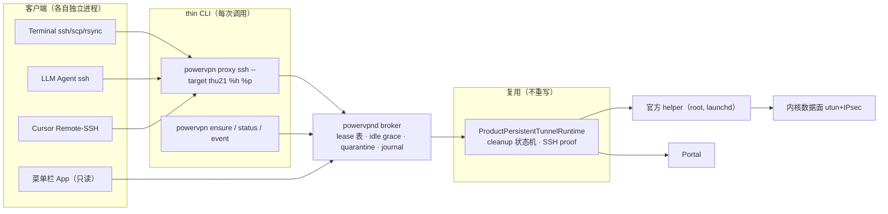

# 多客户端访问 Broker + 托管 SSH 集成 + 薄菜单栏壳 — 设计文档

状态：设计稿，待评审。基线 `rescue-mvp` HEAD `723cc0a`（2026-08-17）。
前置输入：只读架构评审结论（单 owner 事务引擎保留，三个使用入口需要共享连接
broker）及评审设计域护栏；证据档案
`~/scratch-data/powervpn-attempt-history-2026-08-16/dossier.md`、
`~/scratch-data/powervpn-catalog-investigation-2026-08-16/{failure-hunter,session-oracle,timeline}.md`。
全文 value-free：配置值为占位符，主机示例用文档保留段（192.0.2.0/24）。

**范围声明**：本文档是设计交付物，不含任何实现；不改动 Sources/Tests/
Package.swift。证据标注约定——`[observed]` = 田野/live 记录，
`[hypothesis]` = 一致性排位假设，未经实验证明。

---

## 1. 目标与非目标

### 目标

三个用户入口共用一条隧道、一次 Portal acquisition、一个 helper generation：

| 入口 | 现状 | 目标 |
|---|---|---|
| Terminal `ssh` / `scp` / `rsync` | 每条命令独立起一次隧道（proxy ssh per-invocation） | 第一条命令建隧道，后续秒连 |
| LLM Agent 标准 `ssh` | 同上；agent 无法区分"要人操作"与"可重试" | `powervpn ensure --json` 给出机器可判定的下一步 |
| Cursor / VS Code Remote-SSH | 每个窗口独立 ProxyCommand，connectTimeout 90s 与事务预算错位 | 隧道常驻 broker，Remote-SSH 秒级 attach |

交付物三件：`powervpnd` broker（launchd socket activation）、托管 SSH 集成
（`powervpn setup` / `integration repair`）、薄菜单栏 App（独立 target，不阻塞）。

### 非目标

- **Slurm / GPU 作业流**：那是 `thu21-gpu-workflow` 的领域。本仓库最多提供
  `powervpn target context <id> --json`（无秘密：只有 host/port/user 等已公开
  于 targets.json 的连接上下文），供其编排层消费。
- **不修复 teardown 臂 helper SIGILL**（评审护栏 #1）：broker 只把暴露频率
  从"每次 SSH 调用一次 teardown"降到"每次会话一次 teardown"。vendor helper
  在 stop 时的崩溃率田野记录为 23/23 `[observed]`（dossier 逐帧钉死其中
  4/4 到达 CHILD_SA 建立的运行全部崩溃）——**任何长生命周期会话的最终
  cleanup 都应当被预期撞上它**。设计必须与 crashed helper 共存，详见 §3.3
  硬性不变量与 §8 R1。
- 不重写隧道栈：数据面仍由官方 helper 在内核建（utun + IPsec SA）。
- 菜单栏 App 不做 Developer ID 签名 / 公证（dev 阶段 ad-hoc，见 §6）。

---

## 2. 现状证据（file:line）

### 2.1 每次调用一个 runtime，没有共享入口

`runCurrentMachineProxyCommand` 在每次 CLI 调用内构造
`ProductPersistentTunnelRuntime`（`Sources/PowerVPNCLI/ProxyAccessCommand.swift:35`）。
进程退出即销毁。两个并存的 ssh 进程 = 两次 Portal 登录 + 两个事务。

### 2.2 跨进程互斥只有"失败"，没有"共享"

vendor helper 变更面由 `ProductMutationLease` 的非阻塞 flock 保护
（`Sources/PowerVPNProduct/ProductMutationLease.swift:85-89`）：第二个进程
拿锁得到 `alreadyHeld` 异常直接失败——是互斥，不是排队，更不是复用。

### 2.3 单 open actor：进程内单会话，跨进程无协调

`ProductPersistentTunnelSession` 是显式状态机
（idle/starting/active/stopping/stopped，
`Sources/PowerVPNProduct/ProductPersistentTunnelLease.swift:24-30`），
`open()` 仅接受 idle（`:43-45`），否则 `rejectedPreOpenReport`（`:105-116`）。
协调器本身是 actor（`Sources/PowerVPNProduct/ProductPersistentTunnelCoordinator.swift:14`）。
单 open 语义正确——问题只在于它的生命周期被绑死在 CLI 进程上。

### 2.4 ControlMaster 被迫关闭，共享入口只能是 broker

README 明确 `ControlMaster no`：共享 socket 会让后续连接绕过隧道
（`README.md:134`，理由 `README.md:142`）。OpenSSH 层不能复用，复用必须发生在
ProxyCommand 之下——即 broker。

### 2.5 proxy serve 把别名当显式参数传

`performProxyServe` 把 `invocation.request.sshTarget.rawValue` 直接作为
`/usr/bin/ssh` 的目的参数（`Sources/PowerVPNCLI/ProxyAccessCommand.swift:242`），
依赖用户 `~/.ssh/config` 的隐式别名解析。产品行为被环境文件劫持。

### 2.6 route-only 检查 ≠ 单 host 契约

proxy ssh 打开 lease 后只做 `permitsIPv4(destinationIPv4)` 路由覆盖检查
（`Sources/PowerVPNCLI/ProxyAccessCommand.swift:193-195`），失败 token
`target_not_covered` exit 70。`%h` 是任何被覆盖地址都放行——
"profile 单 host"契约实际未被执行。

### 2.7 credentials.env 的 symlink 声明与实现不符

文档注释声称 "symlinks are rejected"
（`Sources/PowerVPNPortal/EnvFileCredentialReader.swift:22-23`），但
`openCredentialFile` 只做 open 前 `lstat`（`:210-215`），随后是普通
`open(path, O_RDONLY | O_CLOEXEC)`（`:217`）——没有 `O_NOFOLLOW`，lstat 与
open 之间存在 TOCTOU 窗口。对照 targets.json 读取器已经用
`O_NOFOLLOW`（`Sources/PowerVPNPortal/PowerVPNTargetsConfiguration.swift:174`）。
两文件同在 `~/.config/powervpn/`，安全等级应当同级。

### 2.8 本机安装分叉（PATH / worktree / brew 三方）[observed]

机器观察（2026-08-17）：`which -a powervpn` 只有
`~/.local/bin/powervpn`（mtime 2026-08-08 14:08，SHA-256
`aaf9d69e…`，诊断期旧构建）；而 `~/.ssh/config` 的 thu52-vpn Host 块
ProxyCommand 指向 worktree 构建产物
`…/powervpn-cli/.build/out/Products/Release/powervpn`（SHA-256
`6a74572c…`，与前者不同二进制）；brew tap 存在但本机未装
（`/opt/homebrew/bin/powervpn` 不存在）。日常入口实际跑的是哪个二进制，
取决于 ssh config 里写死的路径，PATH 上的那个是 stale 的。

### 2.9 status 真相分叉

`powervpn status` 走 `SystemInspector().status()`，完全不查询产品会话/
隧道状态（`Sources/PowerVPNCLI/main.swift:43-44`）；同时 readiness 观测里
`resourceSource` 恒为 `.unavailable`、candidates 恒空——写死的占位
（`Sources/PowerVPNProduct/ProductReadinessRuntime.swift:74-75`）。broker 之后
"当前有没有隧道、谁在用"必须成为 status 的一等公民。

### 2.10 时间预算错位

事务总预算 120s（work 截止 65s，
`Sources/PowerVPNProduct/ProductM2AbsoluteBudget.swift:59-64`）；cleanup 预算
55s（`Sources/PowerVPNProduct/ProductM2CleanupBudget.swift:6-9`）。Cursor
Remote-SSH 侧 connectTimeout 约 90s：客户端比事务先死，cleanup 沦为
client 进程退出时的 best-effort——这正是 2026-08-16 观察到的"drain 未生效"
（client 3s 退出 vs 10s drain，dossier §A）`[observed]`。

### 2.11 vendor 事实（决定 broker 形态的两条）

- **helper 在 stop/teardown 臂的崩溃是常态而非异常** `[observed]`：
  23/23 个会话在 teardown 崩溃（评审口径）；dossier 逐帧钉死的 4 次
  `.ips` 全部落在 CHILD_SA install/delete 过渡（4/4 到达 CHILD_SA 建立的
  运行全部崩溃；两个 PASS 都是证明捕获之后崩在 teardown）。vendor helper
  在我们的客户端下"每个 established session 崩一次"，launchd 会重拉
  （generation 递增）。**推论**：broker 生命周期内每一条隧道的最终
  cleanup 都应以"预期会撞上 helper 崩溃"为设计前提。
- **catalog 间歇拒绝** `[observed]`：~1/8（全日 10 次 acquisition
  9 OK / 1 拒绝，failure-hunter §1.4）。rank-1 解释——会话生命周期不匹配
  （官方 GUI 一次登录活整个 App 生命周期 + 60.0s `check/session` 保活
  `session-oracle`（interval 常量 60.0 位于 `__TEXT,__const +0x380`），
  我们 fresh-login-per-run）——是 `[hypothesis]`，不是测试证明的事实。
  catalog replay 测试能证明的只有分类 token 与重试状态机的正确性，
  不能证明 live 概率，也不能证明根因。

---

## 3. Broker 设计

### 3.1 进程模型



- **`powervpnd` 是 user LaunchAgent，不是 daemon**。helper 已经是 root；
  broker 不需要也不应该提权。plist 放 `~/Library/LaunchAgents/`。
- **launchd socket activation，on-demand**：plist 声明 Unix domain socket
  （`SockPathName` 指向 `~/.local/state/powervpn/broker.sock`，
  `SockPathMode 0600`，复用 `ProductMutationLease` 已验证的 0700 状态目录
  语义，`Sources/PowerVPNProduct/ProductMutationLease.swift:31-38`）。
  launchd 持有 listening socket；首个连接唤醒 broker；无需常驻。
- **空闲退出**：lease 表空且 grace 到期完成 stop 后，broker 主动 exit；
  launchd 在下次连接时重拉。Mach 服务名（如将来需要）记为
  `local.powervpn.broker`，v1 不使用。

### 3.2 协议：Unix socket 上的 length-prefixed JSON

选 Unix socket + JSON 而非 NSXPC，理由按重要性排序：

1. **可离线测试**：协议层用 socketpair + fixture 即可全量测试，不需要 Mach
   bootstrap namespace；XPC 的 code-signing peer requirement 校验是 helper
   语义（`CPowerVPNXPCSession` 领域），不该泄漏到 client-broker 边界。
2. **凭据永不过协议**：broker 持有凭据读取；协议消息里没有任何秘密字段
   （见验收第 7 条）。
3. 帧格式简单可审计：4 字节大端长度 + UTF-8 JSON，单帧上限 64 KiB。

消息集（全部 request/response，带单调递增 `id`）：

| 消息 | 方向 | 语义 |
|---|---|---|
| `ensure` | CLI→broker | **幂等** acquire-or-attach：profile 已 active → 返回既有 lease；acquiring → 等待并在 `waitMs` 内返回结果；同 client 重发 → 同一 lease（去重键 profile.id + client stream 身份） |
| `acquire` | CLI→broker | `ensure` 底下的非幂等原语（内部/测试用），不暴露给 ProxyCommand |
| `lease` | CLI→broker | 读单条 lease（id → 状态、归属 client、grace 剩余） |
| `release` | CLI→broker | 释放一条 lease；最后一条释放后进入 idle grace 倒计时 |
| `status` | CLI→broker | 全量快照：engine 状态机状态、lease 表、helper generation、journal cursor |
| `event.poll` | CLI→broker | 带 cursor 增量拉取 redacted journal（菜单栏 App 与 `powervpn event show` 共用） |

幂等 `ensure` 的关键是**结果缓存**：同 profile 的并发 ensure 共享一次
acquisition 的 outcome（成功共享 lease；失败共享同一 token + event id，
不触发第二次 Portal 登录）。

### 3.3 ClientLease 生命周期与硬性不变量

#### 3.3.1 生命周期

- **首 client 触发 acquire**：一次 Portal acquisition、一次 helper
  generation 消耗，全程在 broker 生命周期内。
- **同 AccessProfile 复用**：第二、第三个 client 的 ensure 直接拿到 lease，
  零 Portal 流量、零 helper 变更。
- **每 SSH stream 一条 lease**：ProxyCommand 进程 = 一条 lease；进程死亡
  （SIGKILL 含）由 broker 侧检测（client pid + socket 断开）回收，不影响
  其他 lease。
- **`target_conflict`**：tunnel active 时另一 profile 的 ensure 返回
  `target_conflict`（fail-closed，不静默切换）。人工切换 =
  等待 idle grace 或显式 `powervpn stop`。自动排队切换列为开放问题（§8 Q3）。
- **idle grace**：最后一条 lease 释放后默认 600s（可配区间 120–600s，
  AccessProfile.idleGraceSeconds）。到期执行现行 stop 链
  （child-down ordinary 事件完成 + 10s drain，全部已在 engine 内）。
  grace 期间新 ensure 秒级命中。
- **quarantine**：任何路径上出现 `cleanup_unproven`（exit 74 家族）或
  helper generation 异变，该 profile 进入 quarantine——ensure 一律返回
  `requiresHumanAction=true`，**禁止自动重试**。解除 =
  `powervpn recovery clear`（人工）。
- **broker crash 恢复**：journal（§3.6）只是恢复线索，不是连接证明。

#### 3.3.2 硬性不变量（评审护栏，验收必须逐条覆盖）

针对 teardown 臂 SIGILL 23/23 `[observed]` 的共存设计，以下为硬性要求，
不是最佳实践：

1. **helper generation 对账（每次状态迁移）**：broker 的每一步状态迁移
   （acquire 前后、route 激活前后、stop 前后、恢复期间）都读取并比对
   helper generation；不一致 = helper 崩溃被 launchd 重拉过的确凿信号，
   立即进入恢复核实流程，不得继续假定在途状态。
2. **orphan / crashed-helper 识别**：broker 必须能识别"engine 认为隧道在、
   但 helper 进程已经换代"的孤儿态（generation 不匹配 / XPC
   connectionInvalid / 状态查询超时三重信号），并把它归类为
   `recovery_required`，而不是当成正常 active。
3. **`cleanup_unproven` → quarantine，无自动重试**：exit 74 家族一旦出现，
   profile 进 quarantine；任何自动重登/重连/重试路径都被禁止——1/8
   catalog 拒绝 `[observed]` 与崩溃相关失败叠加时，自动重试只会制造
   重试风暴与更多半变更态。
4. **禁止 broad kill**：broker 永远不 pkill/killall helper 或官方 GUI；
   helper 的生死只属于 launchd。broker 对 crashed helper 的唯一合法动作
   是"识别 + 核实 + 报告"。
5. **journal 永不显示为 connected**：`connected` 只能来自当次进程的实测。
   launchd 重拉的 broker 在报告任何绿色状态（connected/active）之前，
   必须重新测量三件事——helper generation 一致、路由覆盖仍在、数据面
   探活通过；任一不符 → `recovery_required`。journal 里的历史
   connected 记录只可作为线索，永远不是显示依据。

### 3.4 AccessProfile schema 与 targets.json 迁移

```json
{
  "version": 2,
  "profiles": {
    "thu21": {
      "resourceBinding": "<resource-display-name>",
      "host": "192.0.2.21",
      "port": 22,
      "user": "<user>",
      "idleGraceSeconds": 600
    }
  }
}
```

- `id` = 外层 key（沿用现 `--ssh-target` 键集约束，
  `Sources/PowerVPNPortal/PowerVPNTargetsConfiguration.swift:134-140` 的字符
  白名单）。`resourceBinding` 收编今天命令行上的 `--resource-display-name`
  （`README.md:83`）——ProxyCommand 缩短的前提是这个值进配置。
- 迁移：v1（`{host, user}`，
  `Sources/PowerVPNPortal/PowerVPNTargetsConfiguration.swift:111-123`）→
  v2 纯增量。读取器同时接受两版；v1 文件在 broker 里程碑内继续可用（走
  默认 port 22 / grace 600s，resourceBinding 缺失时仍接受旧 flag）。
- **ProxyCommand 缩成一行**：

  ```text
  ProxyCommand <binary-path> proxy ssh --target thu21 %h %p --non-interactive
  ```

  `--resource-display-name` / `--ssh-target` 降级为 `--target` 的废弃别名，
  一个过渡期后删除（clean cutover）。

### 3.5 复用边界与新 target 职责

**原样复用（不重写）**：`ProductPersistentTunnelRuntime`（含单 open actor）、
cleanup 状态机（`ProductM2CleanupBudget`、drain、stop-via-child-down）、
fresh SSH proof、全部 value-free report 结构。

**新 library target `PowerVPNBroker`**（依赖 `PowerVPNProduct`、
`PowerVPNPortal`；被 `PowerVPNCLI` 与将来的菜单栏 App 依赖——CLI 从此是薄壳）：

| 职责 | 说明 |
|---|---|
| socket 监听 + 帧编解码 | §3.2 协议 |
| lease 表 + idle grace 计时 | §3.3 |
| quarantine 状态机 | §3.3.2 不变量 3 |
| helper generation 对账器 | §3.3.2 不变量 1/2 |
| AccessProfile 加载/迁移 | §3.4 |
| redacted journal（有界环形） | §3.6 |
| crash 恢复核实器 | generation/route/data-plane 三重核实（不变量 5） |
| engine 宿主 | 持有 `ProductPersistentTunnelRuntime` 实例的进程内唯一持有者 |

依赖方向单向：`PowerVPNCLI → PowerVPNBroker → PowerVPNProduct →
{PowerVPNCore, PowerVPNPortal}`。CLI 侧 proxy 命令退化为：解析 argv →
发 `ensure` → 拿到 lease 后 exec `/usr/bin/nc`（数据面字节流语义不变）。

### 3.6 Agent API 与诊断出口

- `powervpn ensure --target <id> --json`
- `powervpn status --json`
- `powervpn event show <event-id>`

JSON 判定字段（对 LLM agent 机器可读）：
`requiresHumanAction` / `retryable` / `retryAfterMs` / `recommendedAction`
（closed-set token，如 `wait_idle_grace` / `run_recovery_clear` /
`check_credentials`）。

**ProxyCommand stdout 永远是纯 SSH 字节流**——任何诊断不得混入。诊断出口
三个：(1) stderr 稳定 token（沿用现有
`tunnel_open_failed:…:selection=…:catalog=…` 家族，
`Sources/PowerVPNCLI/ProxyCommandSupport.swift:80-98`）；(2) token 尾部带
`event=<id>`；(3) event id 可在 broker journal 里查到 redacted 上下文。
journal 只记 token/枚举/时间戳/计数，永不记值。

### 3.7 时间预算：90s 客户端 vs 120s 事务

错位在 broker 内按三种路径消解：

1. **快路径**（隧道已 active）：lease 授予 < 1s，与 connectTimeout 无关。
2. **慢路径**（首 acquire）：acquisition 挂在 broker 生命周期上，不挂在
   client 上。client 90s 超时死了，acquisition 继续走完并正常 cleanup——
   helper 永远不会因为"客户端先死"停在半变更态（2.10 的根因消除）。
   下一个 client 的 ensure 直接命中刚建好的隧道。
3. **忙路径**（acquiring 中）：ensure 立即返回 `retryable=true` +
   `retryAfterMs`（按 budget 剩余估算），client 快速失败而不是干等。

cleanup 55s 始终在 broker 进程内完成（idle grace 到期或 quarantine 时），
不再受任何 client 进程存活约束。

---

## 4. Broker 前的三个先行修复

三个都是小 delta，独立于 broker 可先落地、先验证。

1. **proxy serve 显式 argv**：`performProxyServe` 不再传别名
   （2.5，`ProxyAccessCommand.swift:242`），改为显式
   `/usr/bin/ssh -N -T -D … -l <user> -p <port> <numeric-host>`，全部来自
   resolved profile。产品行为与用户 ssh config 解耦。
2. **%h/%p 精确匹配**：route-only 检查（2.6）升级为单 host 契约——
   `%h == profile.host && %p == profile.port`，否则 fail-closed token
   `target_mismatch`（新 token，与 `target_not_covered` 区分语义：前者是
   配置写错，后者是路由未覆盖）。显式 route-profile schema（profile 声明
   覆盖 CIDR 列表）列为将来扩展，v1 不做。
3. **credentials.env 同级安全打开**：`openCredentialFile` 改
   `open(path, O_RDONLY | O_CLOEXEC | O_NOFOLLOW)`，且 open 后 `fstat` 的
   dev/ino 与 open 前 `lstat` 核对（防 TOCTOU 换文件），对齐 targets.json
   读取器的强度（2.7）。**长期方向**：凭据迁 Keychain + 有时限 UserGrant
   （grant 记录带过期时间；live 助跑的人工批准短语闸门不变）——Keychain
   迁移是独立里程碑，不阻塞 broker。

---

## 5. 托管 SSH 集成（powervpn setup / integration repair）

针对 2.8 的三方分叉。命令族：`powervpn setup`（首次）、
`powervpn integration repair`（修复）、`powervpn integration status`。

- **分叉检测**：解析 PATH 上的 `powervpn`（记录二进制 SHA-256）、SSH include
  引用的二进制、brew 安装位；分类 ok / `path_diverged` / `include_missing` /
  `include_stale`（manifest 记录的 SHA ≠ 当前）。
- **托管 include**：单一 managed 文件
  `~/.ssh/config.d/20-powervpn.conf`（`~/.ssh/config` 顶部一次性插入一行
  `Include`，带标记注释）。每个 AccessProfile 一个 Host 块，块内容全部由
  产品生成（HostName=数字地址、Port、User、`ControlMaster no`、缩短后的
  ProxyCommand）。
- **diff + 备份 + 回滚**：每次改动前先写时间戳备份；`integration repair
  --rollback` 恢复最近备份。标记区间内检测到手工改动 → 拒绝并要求
  `--force`（先备份再重写）。
- **验证**：`ssh -G <host>` 解析生效配置，断言 ProxyCommand/HostName/Port/
  User/ControlMaster 与托管值一致——纯离线，不发起连接。
- **manifest 四态**：`~/.local/state/powervpn/integration.json` 按 Host 块
  记录 `offline-tested`（ssh -G 通过）/ `live-tested`（真实 ssh 过）/
  `released`（随 release tag 发布的配置形态）/ `locally-installed`
  （本机手工装过、未经产品验证）+ 二进制 SHA + 配置文件哈希。2.8 的
  worktree 路径引用会被显式标成 `locally-installed` 并提示 repair。

---

## 6. 薄菜单栏 App

- 独立 App target `PowerVPNMenuBar`（SwiftUI `MenuBarExtra`，accessory）。
  不阻塞 broker 里程碑；只依赖 `PowerVPNBroker` 的只读协议。
- **状态行**：`Connected · 3 clients` / `Idle · grace 04:12` /
  `Recovery required` / `Quarantined`。
- **五层真相**（每层独立可折叠，不做单一布尔）：
  1. installation（helper 在位/官方 GUI 在跑——沿用 readiness 观测语义）
  2. authorization（凭据文件在位、grant 未过期）
  3. helper-route-dataplane（generation、路由覆盖、SSH proof 新鲜度）
  4. clients（lease 列表：入口类型、grace 剩余）
  5. cleanup（最近一次 shutdown report 摘要）
- **通知策略**：进入 quarantine / recovery_required 发用户通知；瞬态事件
  静默。这是 2.9 status 真相分叉的产品级出口——App 与 CLI status 同源
  （同一 broker snapshot）。
- **实现约束**：SwiftUI 只订阅 broker snapshot（§3.2 `status` /
  `event.poll`），不 shell-out 解析 CLI JSON。App 永不从 journal 渲染
  connected（§3.3.2 不变量 5 同样约束 App）。
- **签名/分发**：dev 阶段 ad-hoc 签名 + 手动启动（或 LaunchAgent 拉起）；
  Developer ID / 公证列入开放问题（§8 Q4）。

---

## 7. 里程碑切分与验收

| 切片 | 内容 | offline gate |
|---|---|---|
| M-B0 | §4 三修复 | argv 构造单测；`target_mismatch` 谓词单测；symlink-swap 攻击 fixture（注入路径级测试，lstat/open 间隙换链接必须被拒） |
| M-B1 | `PowerVPNBroker` target：协议 DTO、lease 表、idle grace、quarantine 状态机（fake engine） | 全量单测 + socketpair 协议一致性 round-trip；**含 23/23 前提下的 stop-链合成测试：注入"stop 中途 helper generation 跳变"必须产出 recovery_required 而非失败重试** |
| M-B2 | `powervpnd` launchd agent + socket activation；CLI proxy 改走 broker（保留 `--direct` 逃生门一个过渡期） | plist fixture 校验；对 stub engine 的 socket activation 冒烟（无 helper、无 Portal）；**broker SIGKILL 重启后 journal-only 状态必须显示 recovery_required（不变量 5 的离线证明）** |
| M-B3 | 真 engine 宿主 + ProxyCommand 字节流纯度保持 | offline：帧纯净性 fixture（stdout 逐字节）；live：下方验收清单 |
| M-B4 | 托管 SSH 集成（§5） | `ssh -G` fixture 矩阵（含 2.8 三方分叉样本）；回滚往返测试 |
| M-B5 | 菜单栏 App（§6，与 M-B3+ 并行） | snapshot 渲染快照测试（五层真相 fixture；connected 只来自实测 snapshot） |

**Live 验收（评审清单，M-B3 收口）**：

1. 四客户端并存：Terminal `ssh`/`scp`/`rsync` + Agent ssh + Cursor
   Remote-SSH（≥4 并发 lease）。
2. 单次 Portal acquisition：全程恰好一次登录（journal 计数）。
3. 单 helper generation：整个会话 generation 增量 ≤ 1（正常路径；若
   teardown 撞上 SIGILL，generation 跳变必须被对账捕获并正确分类——
   不变量 1/2 的 live 证明）。
4. 杀一个 client（SIGKILL）：其余 client 的 stream 不中断。
5. idle grace 清理证明：全部释放 → grace 到期 → stop 链完成 →
   cleanupVerified=true（若 stop 撞上 helper 崩溃，允许的终态是
   "崩溃被识别 + recovery/重新核实后真实状态"，绝不允许谎报）。
6. broker 被 SIGKILL 后：重启仅两种结局——报告真实状态（三重核实通过）
   或 `recovery_required`；永不谎报 connected（不变量 5）。
7. Agent / Cursor 读不到凭据：协议消息无秘密字段；两个客户端进程的
   环境与内存中无凭据（凭据只在 broker 内）。
8. 日常动作仍是 `ssh thu21`（一行 ProxyCommand，无新记忆负担）。

---

## 8. 风险与开放问题

### 风险

- **R1（关键新风险）：长驻 broker × teardown SIGILL——共存，不是修复**。
  broker **不修复** teardown 臂 SIGILL；它只把暴露频率从每 SSH 调用一次
  降到每会话一次。stop 崩溃率田野记录 23/23 `[observed]` ⇒ 任何长生命周期
  会话的最终 cleanup 都应被**预期**撞上 helper 崩溃。变化的是"崩在谁的手
  里"：现在崩在 broker 的 stop 链里，broker 必须与 crashed helper 共存
  （§3.3.2 五条硬性不变量就是共存设计）。真正的分叉点在 Q1：内核数据面
  是否随 helper 死亡存活——决定共存是"透明重核"还是"整段重建"。
- **R2：install 臂 SIGILL 落在 broker acquire 上**。400/800ms 静默门已落地
  （memory：`60d0581c`），broker 的长生命周期反而让"session 在 CHILD_SA
  过渡期间保持打开"成为默认形态（PASS 包络的条件之一，dossier §C）。
  残余风险由 quarantine + requiresHumanAction 兜底。
- **R3：catalog 1/8 间歇在 broker 模型下的收益与残留**。首 acquire 每
  grace 窗口只发生一次——单次拒绝的代价从"这次 ssh 失败"降为"一次
  requiresHumanAction"（此收益是结构推理，非实测）。残留：首个 client
  仍可能撞上；1/8 比率与 fresh-login 根因均为 `[hypothesis]`
  （§2.11），会话保活模式（对齐官方 60s `check/session`）可望进一步压低
  但改变授权边界，见 Q2。**catalog replay 测试在此里程碑里只用于证明
  分类/重试状态机的正确性，不用于宣称概率或根因。**
- **R4：菜单栏 App 分发**。ad-hoc 签名在 dev 阶段足够；Gatekeeper 对
  ad-hoc 长驻 App 的态度（本机自用无碍，分享给他人不可安装）见 Q4。

### 开放问题（按风险排序）

1. **内核数据面在 helper SIGILL 后是否存活**（R1 的分叉点）：utun + IPsec
   SA 在内核，helper 进程死亡理论上不拆 SA——但 4 次崩溃样本全部发生在
   client 已退出/run 尾，从未观察过"helper 崩了、隧道还在、下一个 client
   接着用"的场景 `[observed: 缺失]`。需要一次专门 live 实验（M-B3 期间让
   teardown 崩溃自然发生并立即 ensure）。两种答案对应两条实现路线
   （透明重核 vs stop-then-start 重建），成本差一个量级。
2. **idle grace 与 Portal 会话生命周期是否耦合**：grace 命中后走 fresh
   login（现状，授权边界不变，代价是留在 1/8 `[hypothesis]` 概率池），
   还是 broker 内实现 60s `check/session` 保活（对齐官方行为、预期压低
   catalog 拒绝——但这是 `[hypothesis]` 收益，且等于把"一次登录多会话"
   产品化，需要 Larry 明确批准——同 R2 持久会话的既有边界）。
3. **target_conflict 的策略终点**：硬错误（v1 设计）够不够？若日常真的
   需要在两台目标间切换，排队切换（drain → stop → 新 acquire）的等待
   体验上限是 120s+55s 事务预算——是否可接受，还是必须做双 profile
   并存（受 helper 单变更面约束，基本不可行，需评审确认后写死为非目标）。
4. **`~/.ssh/config` 的 Include 兼容性**：极老 OpenSSH 不支持 Include
   （macOS 14.4+ 自带 9.x 支持，理论无风险）；但用户已有 config 的
   `Include` 语义冲突（通配符吞掉我们的 Host 块）没有离线办法穷尽，
   `ssh -G` 验证矩阵只能覆盖已知形态。
5. **菜单栏 App 的最终分发形态**（Developer ID 签名 + 公证，还是长期
   ad-hoc 自用）：不阻塞任何里程碑，留到有第二个用户再定。

---

## 附：与既有分支策略的关系

本设计全部落在 `rescue-mvp`（`docs/branching.md`：活跃开发线）。M-B0–M-B4
按切片推进、每片独立可回滚；菜单栏 App target（M-B5）合入不改变
`main` 只随 release tag 推进的规则。
